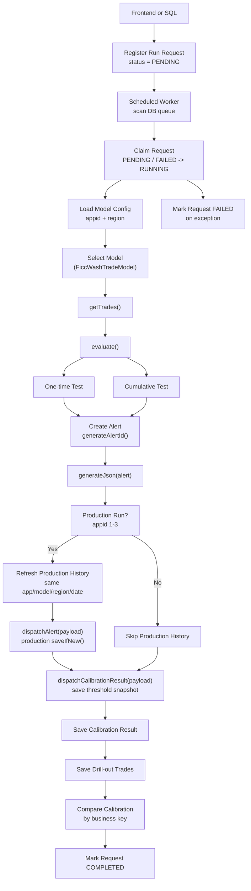

# Trade Surveillance Model

Java 17 Spring Boot portfolio project for a rule-based FICC wash trade surveillance model, with a small React request console for local demos.

FICC means Fixed Income, Currencies, and Commodities. The application can run from a database-backed request queue. Each request contains an `appid`, `region`, and `businessDate`; the worker claims a pending request, marks it running, resolves the matching surveillance model class from MySQL master/config tables, loads trades through the concrete model, looks up runtime thresholds and lookup windows from a threshold table, evaluates opposite-side matched trades, creates explainable surveillance reports, converts reports to JSON, stores alert history, stores calibration result snapshots, dispatches new alerts to the console, and marks the request completed or failed.

## Key Features

- Spring Boot scheduled queue worker that scans MySQL and processes `PENDING` and `FAILED` surveillance run requests.
- Database-driven model lookup using `appid`, `region`, and `model_class_name`.
- Stored procedure based trade ingestion through `sp_get_ficc_trades`.
- Rule-based FICC wash trade detection with no machine learning dependency.
- Two detection modes: one-time same-day matching and cumulative lookup-window matching.
- Runtime threshold lookup from `surveillance_model_threshold`, including `lookup_days` for cumulative surveillance.
- Explainable alert JSON containing matched trades, aggregate amounts, threshold values, and detection reasons.
- Duplicate alert prevention through alert fingerprints in alert history tables.
- Alert business-key storage using trade date, instrument, maturity, currency, trader, and counterparty fields.
- Drill-out trade storage in `ficc_wash_alert_history_trade` for investigation and interview demos.
- Calibration requests with appids `4` to `6`, custom thresholds, and separate calibration result history.
- Non-calibration appids `1` to `3` write production history and also mirror results into calibration history for comparison.
- Calibration result comparison against production history by alert business key: unchanged results stay white, production-only removed results show gray, and new calibration-only alerts show yellow in the frontend.
- Daily rolling application logs under the local `logs` directory.
- Lightweight React frontend for registering local run requests, searching production alert history, and reviewing calibration requests/results through REST APIs.

## Design Shape

The Spring Boot entry point is intentionally thin and only boots the application plus scheduling:

```text
com.portfolio.ficc.FiccWashModelApplication
```

Scheduled polling is handled by:

```text
com.portfolio.ficc.app.FiccRunRequestScheduler
```

The scheduler delegates claimed queue work to:

```text
com.portfolio.ficc.app.FiccRunRequestWorker
```

The worker claims DB requests and then calls the surveillance pipeline service:

```text
com.portfolio.ficc.app.FiccSurveillanceApplication
```

Model behavior is implemented through an abstract base class:

```text
com.portfolio.ficc.surveillance.AbstractSurveillanceModel
com.portfolio.ficc.surveillance.FiccWashTradeModel
```

The database stores `model_class_name`, and Java resolves it through `SurveillanceModelRegistry`. Model class metadata lives in `surveillance_model_master`, while `surveillance_model_config` provides the model ID mapping used by thresholds and alert history. This keeps model selection database-driven while still restricting execution to registered, whitelisted model classes.

Runtime flow:



## Five-Method Pipeline

0. `getSpecificModel(int appId, String region)`
   Calls `sp_get_surveillance_model_config(appid, region)` and receives the active model configuration. The result includes `model_class_name`.

1. `AbstractSurveillanceModel.getTrades(ModelConfig modelConfig, String region, LocalDate businessDate)`
   Implemented by `FiccWashTradeModel`. It sends `appid`, `modelid`, `region`, and `businessDate` to the trade stored procedure. The procedure joins `surveillance_model_threshold`, reads `CUMULATIVE_MIN_TOTAL_AMOUNT.lookup_days`, and returns trades from `businessDate - lookup_days` through `businessDate`.

2. `AbstractSurveillanceModel.evaluate(ModelConfig modelConfig, List<Trade> trades, LocalDate businessDate)`
   Implemented by `FiccWashTradeModel`. It uses the input `businessDate`, looks up runtime thresholds through `sp_get_surveillance_model_threshold`, then applies deterministic matching. One-time reports are generated from matched BUY/SELL pairs on the business date. Cumulative reports are generated from grouped BUY/SELL activity with the same instrument and counterparty inside the lookup window.

3. `AbstractSurveillanceModel.generateAlertId(Trade tradeA, Trade tradeB)`
   Uses an `AtomicInteger` sequence and creates alert IDs like `ficc_wash_alert_1`, `ficc_wash_alert_2`, and so on.

4. `AbstractSurveillanceModel.generateJson(Alert alert)`
   Converts the alert to a JSON payload with `alertId`, `alertType`, `matchType`, `tradeA`, `tradeB`, `relatedTrades`, aggregate quantities, aggregate amounts, threshold amount, reasons, and `createdAt`.

5. `AbstractSurveillanceModel.dispatchAlert(long requestId, ModelConfig modelConfig, LocalDate businessDate, Alert alert, String alertPayload)`
   Dispatches the already-generated JSON payload into the production alert history tables. Production appids `1` to `3` also call `dispatchCalibrationResult(...)` so the same output is mirrored into calibration history with the threshold snapshot used by that run. Calibration appids `4` to `6` only write calibration result history.

The main method intentionally runs JSON generation and dispatch step by step through the selected model:

```java
for (Alert alert : alerts) {
    String alertPayload = model.generateJson(alert);
    boolean productionSaved = !calibrationRun
            && model.dispatchAlert(requestId, modelConfig, businessDate, alert, alertPayload);
    boolean calibrationSaved = model.dispatchCalibrationResult(requestId, modelConfig, businessDate, alert, alertPayload);
    if (productionSaved || calibrationSaved) {
        dispatchedAlerts++;
    }
}
```

## MySQL Model Tables

The application first resolves `appid` and `region` through this stored procedure:

```sql
CALL sp_get_surveillance_model_config(1, 'NAMR');
```

The procedure reads from the master/config tables:

```text
surveillance_model_master
surveillance_model_config
surveillance_run_request
surveillance_model_threshold
ficc_wash_alert_history
ficc_wash_alert_history_trade
ficc_wash_calibration_alert_history
ficc_wash_calibration_alert_history_trade
```

Table responsibilities:

| Table | Purpose |
| --- | --- |
| `surveillance_model_master` | App and model metadata. Primary key is `appid`; key columns are `appid`, `region`, `name`, `model_code`, `model_name`, and `model_class_name`. |
| `surveillance_model_config` | Execution model ID mapping. Key columns are `appid`, `modelid`, and `region`. |
| `surveillance_run_request` | Queue-style run request table. Stored procedures claim `PENDING` and `FAILED` rows, mark them `RUNNING`, then write `COMPLETED` with generated alert count or `FAILED` with `error_message`. |
| `surveillance_model_threshold` | Runtime thresholds. `evaluate()` calls `sp_get_surveillance_model_threshold` to retrieve amount/tolerance thresholds. The `lookup_days` column controls how far back `sp_get_ficc_trades` queries for cumulative surveillance. |
| `ficc_wash_alert_history` | Production alert dispatch history for appids `1` to `3`. Before a production run is reprocessed, rows for the same app/model/region/business date are refreshed. The table stores `alert_business_key_hash` and the business key fields used for calibration comparison. |
| `ficc_wash_alert_history_trade` | Production drill-out trade snapshot table. It stores each related trade for a generated alert, including trade date/time, instrument, side, quantity, amount, counterparty, account, trader, desk, book, broker, and BUY/SELL leg role. |
| `ficc_wash_calibration_alert_history` | Calibration result history. It stores alert JSON, the threshold snapshot used for that request, and the same business key fields as production history. Calibration appids `4` to `6` write here only; production appids also mirror rows here for comparison. |
| `ficc_wash_calibration_alert_history_trade` | Calibration drill-out trade snapshot table. It keeps the related trades for each calibration result row. |

The seed data creates three production app rows and three calibration app rows:

| appid | region | name |
| ---: | --- | --- |
| 1 | NAMR | NAMR FICC Surveillance App |
| 2 | EMEA | EMEA FICC Surveillance App |
| 3 | APAC | APAC FICC Surveillance App |
| 4 | NAMRC | NAMRC FICC_WASH Model |
| 5 | EMEAC | EMEAC FICC_WASH Model |
| 6 | APACC | APACC FICC_WASH Model |

## Model Class Lookup

The config table stores the concrete model class:

```text
com.portfolio.ficc.surveillance.FiccWashTradeModel
```

`SurveillanceModelRegistry` must also register that class. If the DB contains an unregistered class name, the program fails fast instead of executing arbitrary code.

## MySQL Stored Procedure Input

Stored procedure names are hard-coded as Java class fields. For `FiccWashTradeModel`, the model calls:

```sql
CALL sp_get_ficc_trades(1, 1, 'NAMR', '2026-06-05');
```

Expected result columns:

```text
trade_id, trade_timestamp, asset_class, instrument_id, maturity, currency,
side, quantity, price, counterparty_id, account_id, beneficial_owner, trader_id, desk, book, broker
```

A runnable schema, stored procedure, and sample data are included in:

```text
sql/mysql_schema_and_sample_data.sql
```

The included sample data covers NAMR, EMEA, and APAC trades from `2026-06-01` through `2026-06-05`. With `CUMULATIVE_MIN_TOTAL_AMOUNT.lookup_days = 4`, the trade stored procedure can load a five-day cumulative window. Each business date is seeded to produce production-positive examples, negative examples, and selected calibration-only candidates that can appear when thresholds are lowered or tolerances are widened.

| Business date | Expected positive examples |
| --- | --- |
| `2026-06-01` | one same-day one-time match and one same-day cumulative match |
| `2026-06-02` | one one-time match and one cumulative match using `2026-06-01` plus `2026-06-02` trades |
| `2026-06-03` | one one-time match and one cumulative match using `2026-06-02` plus `2026-06-03` trades |
| `2026-06-04` | one one-time match and one cumulative match using `2026-06-03` plus `2026-06-04` trades |
| `2026-06-05` | one one-time match for `T-NAMR-UST-001`/`T-NAMR-UST-002` and one cumulative FX match across the lookup window |

The same seed also includes negative examples with low notional, mismatched quantity, or different counterparties so not every trade pair generates an alert.

For production runs, old production history for the same app/model/region/business date is deleted before the fresh run results are inserted. Calibration results are retained by request ID so different threshold experiments can be compared side by side. When a new alert is saved, the related drill-out trade table keeps the exact trades that made up the report.

## Alert Business Key

Production and calibration history both store a stable comparison key:

```text
match_type
trade_date
asset_class
instrument_id
maturity_date
currency
trader_id
counterparty_id
```

Java stores those fields directly and also stores `alert_business_key_hash`, a SHA-256 hash of the normalized values. Calibration result rows compare against the corresponding production region: `NAMRC -> NAMR`, `EMEAC -> EMEA`, and `APACC -> APAC`.

The comparison intentionally uses the business key rather than only `alert_id` or `related_trade_ids`. That makes calibration review more realistic: a different threshold run can produce different generated IDs or slightly different drill-out rows, while still representing the same surveillance scenario.

Frontend comparison colors:

| Status | Meaning | Frontend color |
| --- | --- | --- |
| `SAME_AS_PRODUCTION` | Calibration alert has the same business key as a production alert | White |
| `PRODUCTION_REMOVED` | Production alert exists, but calibration did not reproduce it | Gray |
| `CALIBRATION_NEW` | Calibration generated a business key not present in production | Yellow |

## Spring Configuration

Runtime configuration lives in:

```text
src/main/resources/application.yaml
```

Example:

```yaml
ficc:
  database:
    url: jdbc:mysql://localhost:3306/ficc_surveillance
    user: root
    password: root

surveillance:
  worker:
    enabled: true
    initial-delay-ms: 3000
    fixed-delay-ms: 5000

logging:
  file:
    name: logs/ficc-wash-surveillance.log
  logback:
    rollingpolicy:
      file-name-pattern: logs/ficc-wash-surveillance.%d{yyyy-MM-dd}.%i.log.gz
      max-file-size: 10MB
      max-history: 30
      total-size-cap: 1GB
  level:
    com.portfolio.ficc: INFO
```

Stored procedure names are hard-coded as Java class fields in the application/model classes.

## Application Logging

The active application log is written to:

```text
logs/ficc-wash-surveillance.log
```

Spring Boot Logback rolling policy keeps daily rolling files with a size index:

```text
logs/ficc-wash-surveillance.2026-06-09.0.log.gz
logs/ficc-wash-surveillance.2026-06-09.1.log.gz
logs/ficc-wash-surveillance.2026-06-10.0.log.gz
```

The current configuration keeps up to 30 days of logs, rolls again when the active file reaches 10 MB, and caps retained log storage at 1 GB.

## How To Run

Load the sample MySQL schema and stored procedure:

```powershell
mysql -u root -p < sql\mysql_schema_and_sample_data.sql
```

The SQL file is a full local demo reset script. It drops and recreates the demo schema objects, stored procedures, seed trades, thresholds, and sample run requests. If your local database was created before the alert business-key columns were added, rerun this script before testing the latest Java code.

Build and run:

```powershell
.\mvnw.cmd clean package
java -jar target\ficc-wash-trade-surveillance-1.0.0.jar
```

After startup, the scheduled worker scans `surveillance_run_request` every five seconds by default, claims `PENDING` and `FAILED` rows, and processes them. The seed SQL inserts pending production requests for NAMR, EMEA, and APAC covering `2026-06-01` through `2026-06-05`.

Run as Spring Boot queue worker:

```powershell
.\mvnw.cmd spring-boot:run
```

Run the React request console in a second terminal:

```powershell
cd frontend
npm install
npm run dev
```

Open:

```text
http://localhost:5173
```

The React development server proxies `/run-request` to Spring Boot on `http://localhost:8080`. The browser submits `appid`, `region`, `businessDate`, and `requestedBy`; Java inserts a `PENDING` row into `surveillance_run_request` and immediately returns the new request ID. The scheduled worker later claims and runs the request from the database queue.

The same frontend uses `GET /alert-history` for the production Result Window. Search results are read from `ficc_wash_alert_history` by `appid`, `region`, and `businessDate`; they are not hard-coded in React. Calibration requests use `POST /calibration-run-request`, `GET /calibration-run-requests`, and `GET /calibration-results?requestId=...`.

Local API summary:

| Endpoint | Method | Purpose |
| --- | --- | --- |
| `/run-request` | `POST` | Register a production run request in MySQL |
| `/alert-history` | `GET` | Search production alert history for `appid`, `region`, and `businessDate` |
| `/calibration-run-request` | `POST` | Register a calibration request and update calibration thresholds |
| `/calibration-run-requests` | `GET` | Load calibration run request rows |
| `/calibration-results?requestId=...` | `GET` | Load calibration results and compare them to production by business key |

## Local MySQL Demo Steps

Use these steps when running the project locally with MySQL Workbench.

1. Create or reset the local demo schema by running:

```sql
SOURCE C:/Users/GRAVITY/eclipse-workspace/FICC_Wash_Model/sql/mysql_schema_and_sample_data.sql;
```

2. Confirm the seeded run requests:

```sql
SELECT request_id, appid, region, business_date, status, requested_by
FROM surveillance_run_request
ORDER BY request_id;
```

3. Start the application from the project root:

```powershell
.\mvnw.cmd spring-boot:run
```

4. Wait for the scheduled worker to scan the queue, then confirm the request moved to `COMPLETED` or `FAILED`:

```sql
SELECT request_id, appid, region, business_date, status, alerts_generated, started_at, completed_at, error_message
FROM surveillance_run_request
ORDER BY request_id DESC;
```

5. Review generated alert history:

```sql
SELECT alert_history_id, request_id, alert_id, match_type, region, business_date,
       trade_date, instrument_id, maturity_date, currency, trader_id, counterparty_id,
       alert_business_key_hash, created_at
FROM ficc_wash_alert_history
ORDER BY alert_history_id DESC;
```

6. Drill into the trades behind each alert:

```sql
SELECT alert_history_id, trade_sequence, trade_id, trade_date, side, quantity, total_amount, counterparty_id, trade_role
FROM ficc_wash_alert_history_trade
ORDER BY alert_history_id DESC, trade_sequence;
```

7. Review calibration result history and the threshold snapshot saved with each result:

```sql
SELECT calibration_alert_history_id, request_id, alert_id, match_type, region, business_date,
       trade_date, instrument_id, maturity_date, currency, trader_id, counterparty_id,
       alert_business_key_hash,
       one_time_min_total_amount, cumulative_min_total_amount,
       quantity_tolerance_percent, total_amount_tolerance_percent, cumulative_lookup_days
FROM ficc_wash_calibration_alert_history
ORDER BY calibration_alert_history_id DESC;
```

8. Insert a new manual request for a repeat run:

```sql
INSERT INTO surveillance_run_request (appid, region, business_date, requested_by)
VALUES (1, 'NAMR', '2026-06-05', 'local-demo');
```

9. Wait for the next scheduled worker scan and compare alert counts with history records. Production rows for the same app/model/region/business date are refreshed, while calibration result rows remain request-specific for later comparison.

10. In the React console, use the production request panel to submit or search production runs. Use the calibration panel to submit a calibration request with different thresholds, click a calibration request row, and review the comparison colors:

```text
white = same business key as production
gray  = production alert removed by calibration
yellow = new calibration-only alert
```

Run unit tests:

```powershell
.\mvnw.cmd test
```

You can also run the main class from an IDE:

```text
com.portfolio.ficc.FiccWashModelApplication
```

In Eclipse or Spring Tool Suite, this class should appear under `Run As > Spring Boot App` after Maven dependencies are refreshed.

## Deterministic Matching Model

Mandatory candidate rules:

| Rule | Requirement |
| --- | --- |
| Same Instrument Rule | Same `assetClass`, `instrumentId`, `maturity`, and `currency` |
| Opposite Side Rule | One `BUY` and one `SELL` |

One-time transaction report:

| Rule | Requirement |
| --- | --- |
| Same Counterparty Rule | `counterpartyId` must match |
| Quantity Tolerance Rule | BUY and SELL quantities must be within `QUANTITY_TOLERANCE_PERCENT` |
| Total Amount Tolerance Rule | BUY and SELL total amounts must be within `TOTAL_AMOUNT_TOLERANCE_PERCENT` |
| Minimum Amount Rule | Matched amount must be greater than or equal to `ONE_TIME_MIN_TOTAL_AMOUNT` |

Cumulative transaction report:

| Rule | Requirement |
| --- | --- |
| Grouping Rule | Group by `assetClass`, `instrumentId`, `maturity`, `currency`, and `counterpartyId` |
| Two-Sided Activity Rule | Group must contain at least one BUY and one SELL |
| Quantity Tolerance Rule | Aggregate BUY and SELL quantities must be within `QUANTITY_TOLERANCE_PERCENT` |
| Total Amount Tolerance Rule | Aggregate BUY and SELL total amounts must be within `TOTAL_AMOUNT_TOLERANCE_PERCENT` |
| Minimum Amount Rule | Aggregate matched amount must be greater than or equal to `CUMULATIVE_MIN_TOTAL_AMOUNT` |
| Lookup Period Rule | `CUMULATIVE_MIN_TOTAL_AMOUNT.lookup_days` controls the historical trade window used by `getTrades()` |

For the MVP, `totalAmount` is calculated as `quantity * price`. In production, this would be replaced by asset-class-specific notional logic.

## Example Console Output

The `createdAt` value changes each run.

```json
----- FICC WASH TRADE ALERT -----
{
  "alertId": "ficc_wash_alert_1",
  "alertType": "FICC_WASH_TRADE",
  "matchType": "ONE_TIME_TRANSACTION",
  "tradeA": {
    "tradeId": "T-NAMR-UST-001",
    "counterpartyId": "CP-ALPHA",
    "quantity": 10000000,
    "price": 99.8125,
    "totalAmount": 998125000.0000
  },
  "tradeB": {
    "tradeId": "T-NAMR-UST-002",
    "counterpartyId": "CP-ALPHA",
    "quantity": 9980000,
    "price": 99.8130,
    "totalAmount": 996133740.0000
  },
  "totalBuyQuantity": 10000000,
  "totalSellQuantity": 9980000,
  "totalBuyAmount": 998125000.0000,
  "totalSellAmount": 996133740.0000,
  "thresholdAmount": 100000000.000000,
  "reasons": [
    "One-time quantity tolerance: actual difference 0.200000%, threshold 5.000000%, within threshold.",
    "One-time total amount tolerance: actual difference 0.199496%, threshold 5.000000%, within threshold.",
    "One-time minimum amount: matched amount 996133740.0000, threshold 100000000.000000, above threshold."
  ],
  "createdAt": "2026-06-05T00:30:00Z"
}

Processed trades for appid=1, modelid=1, model=FICC_WASH_TRADE, class=com.portfolio.ficc.surveillance.FiccWashTradeModel, region=NAMR, businessDate=2026-06-05 and dispatched 2 alerts, skipped 0 duplicates.
```

The real JSON also includes full `tradeA` and `tradeB` objects for each alert.

## Package Structure

```text
com.portfolio.ficc
  FiccWashModelApplication.java
  app
    FiccRunRequestScheduler.java
    FiccRunRequestWorker.java
    FiccSurveillanceApplication.java
  surveillance
    AbstractSurveillanceModel.java
    FiccWashTradeModel.java
    SurveillanceModelRegistry.java
  model
    Alert.java
    AlertBusinessKey.java
    AlertHistoryResult.java
    CalibrationAlertHistoryResult.java
    ModelConfig.java
    RunRequest.java
    RunSummary.java
    Side.java
    ThresholdSnapshot.java
    Trade.java
  io
    AlertDispatcher.java
    AlertHistoryRepository.java
    CalibrationResultRepository.java
    CalibrationThresholdRepository.java
    DatabaseConfig.java
    RunRequestRepository.java
    TradeCsvReader.java
  web
    AlertHistoryController.java
    CalibrationResultController.java
    CalibrationRunRequestController.java
    RunRequestController.java
```

## Future Enhancements

- Add reviewer decisions and case workflow on top of the existing MySQL alert history.
- Add REST APIs for searching run request status and alert-history drill-out trade rows.
- Dispatch alerts to Kafka for downstream case management.
- Move rule weights to JSON, YAML, or database-backed configuration.
- Add account hierarchy and related-party matching.
- Add audit logging for stored procedure inputs, alert IDs, and dispatch status.
