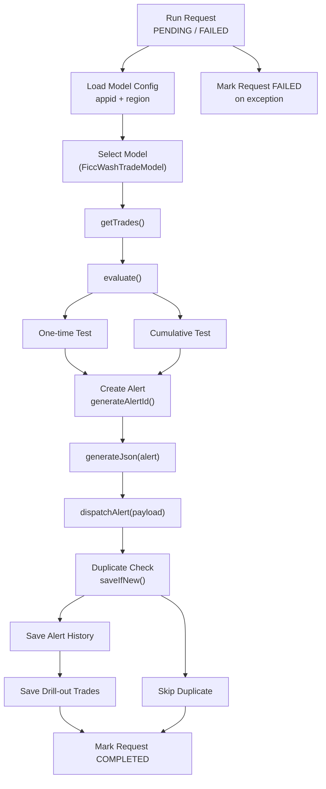

# FICC Wash Trade Surveillance Model

Java 17 Spring Boot portfolio project for a rule-based FICC wash trade surveillance model.

FICC means Fixed Income, Currencies, and Commodities. The application can run from a database-backed request queue. Each request contains an `appid`, `region`, and `businessDate`; the worker claims a pending request, marks it running, resolves the matching surveillance model class from MySQL master/config tables, loads trades through the concrete model, looks up runtime thresholds and lookup windows from a threshold table, evaluates opposite-side matched trades, creates explainable surveillance reports, converts reports to JSON, stores alert history for duplicate prevention, dispatches new alerts to the console, and marks the request completed or failed.

## Key Features

- Spring Boot queue worker that processes `PENDING` and `FAILED` surveillance run requests from MySQL.
- Database-driven model lookup using `appid`, `region`, and `model_class_name`.
- Stored procedure based trade ingestion through `sp_get_ficc_trades`.
- Rule-based FICC wash trade detection with no machine learning dependency.
- Two detection modes: one-time same-day matching and cumulative lookup-window matching.
- Runtime threshold lookup from `surveillance_model_threshold`, including `lookup_days` for cumulative surveillance.
- Explainable alert JSON containing matched trades, aggregate amounts, threshold values, and detection reasons.
- Duplicate alert prevention through alert fingerprints in `ficc_wash_alert_history`.
- Drill-out trade storage in `ficc_wash_alert_history_trade` for investigation and interview demos.
- Daily rolling application logs under the local `logs` directory.

## Design Shape

The Spring Boot entry point is intentionally thin:

```text
com.portfolio.ficc.FiccWashModelApplication
```

It delegates startup arguments to a request worker:

```text
com.portfolio.ficc.app.FiccRunRequestWorker
```

The worker claims DB requests and then calls the surveillance pipeline service:

```text
com.portfolio.ficc.app.FiccSurveillanceApplication
```

Model behavior is implemented through an abstract base class:

```text
com.portfolio.ficc.surveillance.AbstractSurveillanceModel
com.portfolio.ficc.surveillance.FiccWashTradeModel
```

The database stores `model_class_name`, and Java resolves it through `SurveillanceModelRegistry`. Model class metadata lives in `surveillance_model_master`, while `surveillance_model_config` provides the model ID mapping used by thresholds and alert history. This keeps model selection database-driven while still restricting execution to registered, whitelisted model classes.

Runtime flow:



## Five-Method Pipeline

0. `getSpecificModel(int appId, String region)`
   Calls `sp_get_surveillance_model_config(appid, region)` and receives the active model configuration. The result includes `model_class_name`.

1. `AbstractSurveillanceModel.getTrades(ModelConfig modelConfig, String region, LocalDate businessDate)`
   Implemented by `FiccWashTradeModel`. It sends `appid`, `modelid`, `region`, and `businessDate` to the trade stored procedure. The procedure joins `surveillance_model_threshold`, reads `CUMULATIVE_MIN_TOTAL_AMOUNT.lookup_days`, and returns trades from `businessDate - lookup_days` through `businessDate`.

2. `AbstractSurveillanceModel.evaluate(ModelConfig modelConfig, List<Trade> trades, LocalDate businessDate)`
   Implemented by `FiccWashTradeModel`. It uses the input `businessDate`, looks up runtime thresholds through `sp_get_surveillance_model_threshold`, then applies deterministic matching. One-time reports are generated from matched BUY/SELL pairs on the business date. Cumulative reports are generated from grouped BUY/SELL activity with the same instrument and counterparty inside the lookup window.

3. `AbstractSurveillanceModel.generateAlertId(Trade tradeA, Trade tradeB)`
   Uses an `AtomicInteger` sequence and creates alert IDs like `ficc_wash_alert_1`, `ficc_wash_alert_2`, and so on.

4. `AbstractSurveillanceModel.generateJson(Alert alert)`
   Converts the alert to a JSON payload with `alertId`, `alertType`, `matchType`, `tradeA`, `tradeB`, `relatedTrades`, aggregate quantities, aggregate amounts, threshold amount, reasons, and `createdAt`.

5. `AbstractSurveillanceModel.dispatchAlert(ModelConfig modelConfig, LocalDate businessDate, Alert alert, String alertPayload)`
   Dispatches the already-generated JSON payload into alert history tables. Duplicate fingerprints are skipped so overlapping cumulative lookup windows do not create duplicate dispatch records.

The main method intentionally runs JSON generation and dispatch step by step through the selected model:

```java
for (Alert alert : alerts) {
    String alertPayload = model.generateJson(alert);
    if (model.dispatchAlert(modelConfig, businessDate, alert, alertPayload)) {
        dispatchedAlerts++;
    }
}
```

## MySQL Model Tables

The application first resolves `appid` and `region` through this stored procedure:

```sql
CALL sp_get_surveillance_model_config(1, 'NAMR');
```

The procedure reads from the master/config tables:

```text
surveillance_model_master
surveillance_model_config
surveillance_run_request
surveillance_model_threshold
ficc_wash_alert_history
ficc_wash_alert_history_trade
```

Table responsibilities:

| Table | Purpose |
| --- | --- |
| `surveillance_model_master` | App and model metadata. Primary key is `appid`; key columns are `appid`, `region`, `name`, `model_code`, `model_name`, and `model_class_name`. |
| `surveillance_model_config` | Execution model ID mapping. Key columns are `appid`, `modelid`, and `region`. |
| `surveillance_run_request` | Queue-style run request table. Stored procedures claim `PENDING` and `FAILED` rows, mark them `RUNNING`, then write `COMPLETED` with generated alert count or `FAILED` with `error_message`. |
| `surveillance_model_threshold` | Runtime thresholds. `evaluate()` calls `sp_get_surveillance_model_threshold` to retrieve amount/tolerance thresholds. The `lookup_days` column controls how far back `sp_get_ficc_trades` queries for cumulative surveillance. |
| `ficc_wash_alert_history` | Alert dispatch history. It stores JSON payloads and a unique fingerprint based on app/model/region, alert type, match type, and related trade IDs so overlapping cumulative lookup windows do not dispatch the same report again. |
| `ficc_wash_alert_history_trade` | Drill-out trade snapshot table. It stores each related trade for a generated alert, including trade date/time, instrument, side, quantity, amount, counterparty, account, trader, desk, book, broker, and BUY/SELL leg role. |

The seed data creates three regional app rows:

| appid | region | name |
| ---: | --- | --- |
| 1 | NAMR | NAMR FICC Surveillance App |
| 2 | EMEA | EMEA FICC Surveillance App |
| 3 | APAC | APAC FICC Surveillance App |

## Model Class Lookup

The config table stores the concrete model class:

```text
com.portfolio.ficc.surveillance.FiccWashTradeModel
```

`SurveillanceModelRegistry` must also register that class. If the DB contains an unregistered class name, the program fails fast instead of executing arbitrary code.

## MySQL Stored Procedure Input

Stored procedure names are hard-coded as Java class fields. For `FiccWashTradeModel`, the model calls:

```sql
CALL sp_get_ficc_trades(1, 1, 'NAMR', '2026-06-08');
```

Expected result columns:

```text
trade_id, trade_timestamp, asset_class, instrument_id, maturity, currency,
side, quantity, price, counterparty_id, account_id, beneficial_owner, trader_id, desk, book, broker
```

A runnable schema, stored procedure, and sample data are included in:

```text
sql/mysql_schema_and_sample_data.sql
```

The included NAMR sample data covers `2026-06-04` through `2026-06-08`. With `CUMULATIVE_MIN_TOTAL_AMOUNT.lookup_days = 4`, the trade stored procedure can load a five-day cumulative window. Each business date is seeded to produce roughly two reports when run independently:

| Business date | Expected positive examples |
| --- | --- |
| `2026-06-04` | one same-day one-time match and one same-day cumulative match |
| `2026-06-05` | one one-time match and one cumulative match using `2026-06-04` plus `2026-06-05` trades |
| `2026-06-06` | one one-time match and one cumulative match using `2026-06-05` plus `2026-06-06` trades |
| `2026-06-07` | one one-time match and one cumulative match using `2026-06-06` plus `2026-06-07` trades |
| `2026-06-08` | one one-time match for `T-NAMR-UST-001`/`T-NAMR-UST-002` and one cumulative FX match across `2026-06-06` through `2026-06-08` |

The same seed also includes negative examples with low notional, mismatched quantity, or different counterparties so not every trade pair generates an alert.

If the same cumulative trade set is found again on a later run because `lookup_days` overlaps prior business dates, `ficc_wash_alert_history.alert_fingerprint` prevents a second dispatch. When a new alert is saved, `ficc_wash_alert_history_trade` keeps the drill-out trade rows that explain exactly which trades made up the report.

## Spring Configuration

Runtime configuration lives in:

```text
src/main/resources/application.yaml
```

Example:

```yaml
ficc:
  database:
    url: jdbc:mysql://localhost:3306/ficc_surveillance
    user: root
    password: root

logging:
  file:
    name: logs/ficc-wash-surveillance.log
  logback:
    rollingpolicy:
      file-name-pattern: logs/ficc-wash-surveillance.%d{yyyy-MM-dd}.%i.log.gz
      max-file-size: 10MB
      max-history: 30
      total-size-cap: 1GB
  level:
    com.portfolio.ficc: INFO
```

Stored procedure names are hard-coded as Java class fields in the application/model classes.

## Application Logging

The active application log is written to:

```text
logs/ficc-wash-surveillance.log
```

Spring Boot Logback rolling policy keeps daily rolling files with a size index:

```text
logs/ficc-wash-surveillance.2026-06-09.0.log.gz
logs/ficc-wash-surveillance.2026-06-09.1.log.gz
logs/ficc-wash-surveillance.2026-06-10.0.log.gz
```

The current configuration keeps up to 30 days of logs, rolls again when the active file reaches 10 MB, and caps retained log storage at 1 GB.

## How To Run

Load the sample MySQL schema and stored procedure:

```powershell
mysql -u root -p < sql\mysql_schema_and_sample_data.sql
```

Build and run:

```powershell
.\mvnw.cmd clean package
java -jar target\ficc-wash-trade-surveillance-1.0.0.jar
```

Startup always reads `PENDING` and `FAILED` rows from `surveillance_run_request`, queues the claimed requests in the worker, and processes them. The seed SQL inserts five pending NAMR requests for `2026-06-04` through `2026-06-08`.

Run as Spring Boot queue worker:

```powershell
.\mvnw.cmd spring-boot:run
```

## Local MySQL Demo Steps

Use these steps when running the project locally with MySQL Workbench.

1. Create or reset the local demo schema by running:

```sql
SOURCE C:/Users/GRAVITY/eclipse-workspace/FICC_Wash_Model/sql/mysql_schema_and_sample_data.sql;
```

2. Confirm the seeded run requests:

```sql
SELECT request_id, appid, region, business_date, status, requested_by
FROM surveillance_run_request
ORDER BY request_id;
```

3. Start the application from the project root:

```powershell
.\mvnw.cmd spring-boot:run
```

4. Confirm the queue moved to `COMPLETED` or `FAILED`:

```sql
SELECT request_id, appid, region, business_date, status, generated_alert_count, started_at, completed_at, error_message
FROM surveillance_run_request
ORDER BY request_id DESC;
```

5. Review generated alert history:

```sql
SELECT alert_history_id, alert_id, alert_type, match_type, region, business_date, created_at
FROM ficc_wash_alert_history
ORDER BY alert_history_id DESC;
```

6. Drill into the trades behind each alert:

```sql
SELECT alert_history_id, trade_sequence, trade_id, trade_date, side, quantity, total_amount, counterparty_id, trade_role
FROM ficc_wash_alert_history_trade
ORDER BY alert_history_id DESC, trade_sequence;
```

7. Insert a new manual request for a repeat run:

```sql
INSERT INTO surveillance_run_request (appid, region, business_date, requested_by)
VALUES (1, 'NAMR', '2026-06-08', 'local-demo');
```

8. Run the application again and compare alert counts with history records. If a cumulative alert uses the same related trade set as a previous run, the duplicate fingerprint prevents another dispatch.

Run unit tests:

```powershell
.\mvnw.cmd test
```

You can also run the main class from an IDE:

```text
com.portfolio.ficc.FiccWashModelApplication
```

In Eclipse or Spring Tool Suite, this class should appear under `Run As > Spring Boot App` after Maven dependencies are refreshed.

## Deterministic Matching Model

Mandatory candidate rules:

| Rule | Requirement |
| --- | --- |
| Same Instrument Rule | Same `assetClass`, `instrumentId`, `maturity`, and `currency` |
| Opposite Side Rule | One `BUY` and one `SELL` |

One-time transaction report:

| Rule | Requirement |
| --- | --- |
| Same Counterparty Rule | `counterpartyId` must match |
| Quantity Tolerance Rule | BUY and SELL quantities must be within `QUANTITY_TOLERANCE_PERCENT` |
| Total Amount Tolerance Rule | BUY and SELL total amounts must be within `TOTAL_AMOUNT_TOLERANCE_PERCENT` |
| Minimum Amount Rule | Matched amount must be greater than or equal to `ONE_TIME_MIN_TOTAL_AMOUNT` |

Cumulative transaction report:

| Rule | Requirement |
| --- | --- |
| Grouping Rule | Group by `assetClass`, `instrumentId`, `maturity`, `currency`, and `counterpartyId` |
| Two-Sided Activity Rule | Group must contain at least one BUY and one SELL |
| Quantity Tolerance Rule | Aggregate BUY and SELL quantities must be within `QUANTITY_TOLERANCE_PERCENT` |
| Total Amount Tolerance Rule | Aggregate BUY and SELL total amounts must be within `TOTAL_AMOUNT_TOLERANCE_PERCENT` |
| Minimum Amount Rule | Aggregate matched amount must be greater than or equal to `CUMULATIVE_MIN_TOTAL_AMOUNT` |
| Lookup Period Rule | `CUMULATIVE_MIN_TOTAL_AMOUNT.lookup_days` controls the historical trade window used by `getTrades()` |

For the MVP, `totalAmount` is calculated as `quantity * price`. In production, this would be replaced by asset-class-specific notional logic.

## Example Console Output

The `createdAt` value changes each run.

```json
----- FICC WASH TRADE ALERT -----
{
  "alertId": "ficc_wash_alert_1",
  "alertType": "FICC_WASH_TRADE",
  "matchType": "ONE_TIME_TRANSACTION",
  "tradeA": {
    "tradeId": "T-NAMR-UST-001",
    "counterpartyId": "CP-ALPHA",
    "quantity": 10000000,
    "price": 99.8125,
    "totalAmount": 998125000.0000
  },
  "tradeB": {
    "tradeId": "T-NAMR-UST-002",
    "counterpartyId": "CP-ALPHA",
    "quantity": 9980000,
    "price": 99.8130,
    "totalAmount": 996133740.0000
  },
  "totalBuyQuantity": 10000000,
  "totalSellQuantity": 9980000,
  "totalBuyAmount": 998125000.0000,
  "totalSellAmount": 996133740.0000,
  "thresholdAmount": 100000000.000000,
  "reasons": [
    "Same Instrument Rule: assetClass, instrumentId, maturity, and currency match.",
    "Opposite Side Rule: T-NAMR-UST-001 is BUY and T-NAMR-UST-002 is SELL.",
    "Same Counterparty Rule: both trades have counterpartyId CP-ALPHA.",
    "Quantity Tolerance Rule: buy quantity 10000000 and sell quantity 9980000 differ by 0.2%, within threshold 5%.",
    "Total Amount Tolerance Rule: buy amount 998125000.0000 and sell amount 996133740.0000 differ by 0.1995%, within threshold 5%.",
    "Minimum Amount Rule: matched amount 996133740.0000 meets one-time threshold 100000000.000000."
  ],
  "createdAt": "2026-06-08T00:30:00Z"
}

Processed 40 trades for appid=1, modelid=1, model=FICC_WASH_TRADE, class=com.portfolio.ficc.surveillance.FiccWashTradeModel, region=NAMR, businessDate=2026-06-08 and dispatched 2 alerts, skipped 0 duplicates.
```

The real JSON also includes full `tradeA` and `tradeB` objects for each alert.

## Package Structure

```text
com.portfolio.ficc
  FiccWashModelApplication.java
  app
    FiccRunRequestWorker.java
    FiccSurveillanceApplication.java
  surveillance
    AbstractSurveillanceModel.java
    FiccWashTradeModel.java
    SurveillanceModelRegistry.java
  model
    Alert.java
    ModelConfig.java
    RunRequest.java
    RunSummary.java
    Side.java
    Trade.java
  io
    AlertDispatcher.java
    AlertHistoryRepository.java
    DatabaseConfig.java
    RunRequestRepository.java
    TradeCsvReader.java
```

## Future Enhancements

- Add reviewer decisions and case workflow on top of the existing MySQL alert history.
- Add a REST API for triggering surveillance runs by region and date.
- Dispatch alerts to Kafka for downstream case management.
- Move rule weights to JSON, YAML, or database-backed configuration.
- Add account hierarchy and related-party matching.
- Add audit logging for stored procedure inputs, alert IDs, and dispatch status.
